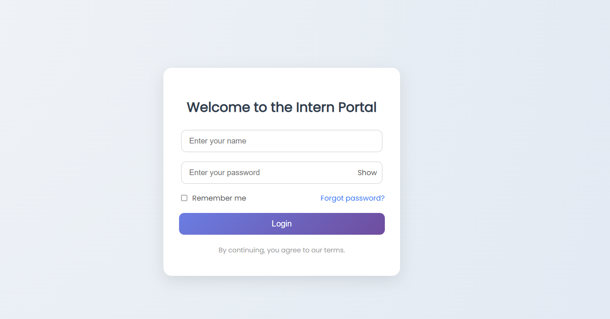
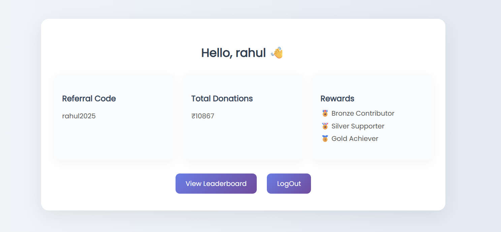
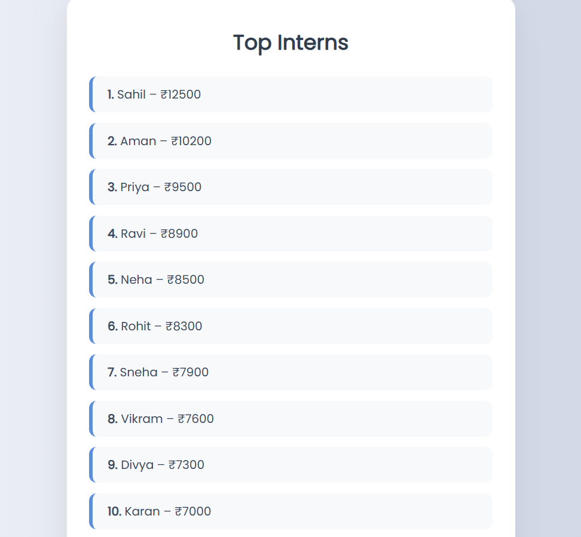

# Intern Fundraising Portal – Full Stack Internship Task (Round 1)

This is a full-stack intern dashboard prototype built as part of the **Round 1 task** for the Full Stack Developer Internship. The portal simulates a real-world environment with login, referral tracking, donations, rewards, and leaderboard.

---

## Screenshots

###  Login Page


###  Dashboard


###  Leaderboard


---

##  Tech Stack

| Frontend             | Backend              | UI Engine    |
|----------------------|----------------------|--------------|
| HTML, CSS, JS        | Node.js, Express.js  | EJS Templates |
| Responsive Design    | Static JSON API      | Google Fonts |

---

##  Features

-  Dummy login page (name + password, no auth)
-  Personalized dashboard with:
  - Dynamic referral code (e.g., `yourname2025`)
  - Donation summary (dummy values)
  - Static reward levels
-  Leaderboard showing top contributors
-  Modern UI design with full responsiveness
-  Clean folder structure: `Frontend/` and `Backend/`

---

##  Folder Structure

internPortal/
├── Backend/
│ ├── routes/
│ ├── data/
│ └── app.js
├── Frontend/
│ └── public/views/
├── public/css/
├── public/js/
└── README.md

---

##  Setup Instructions (Local)

1. **Clone the repository**
   ```bash
   git clone https://github.com/sahilobroy13/intern-portal.git
   cd intern-portal

2. **Install dependencies**
    ```bash
    npm install
    
3. **Run the server**
    ```bash
    npm start
    Open in browser: http://localhost:3000

**Author**
    Sahil Kumar
    Email: sahilobroy579@gmail.com
    GitHub: sahilobroy13

**License**
    This project is licensed for internship submission and educational demo purposes.

---


## ✅ Final Submission Checklist

| Task                                                             | Status ✅ |
|------------------------------------------------------------------|-----------|
| `README.md` created with screenshots and setup instructions      | ✅ Done   |
| Project structured into `Frontend/` and `Backend/` folders       | ✅ Done   |
| Dummy login form with working dashboard and referral system      | ✅ Done   |
| Dashboard displays referral code, name, donations, and rewards   | ✅ Done   |
| Leaderboard displays top contributors using dummy data           | ✅ Done   |
| Responsive and modern UI applied to all pages                    | ✅ Done   |
| Screenshots added to `/screenshots/` folder                      | ✅ Done   |
| All files committed and pushed to GitHub                         | ✅ Done   |
| GitHub repo link ready to be submitted                           | ✅ Done   |


